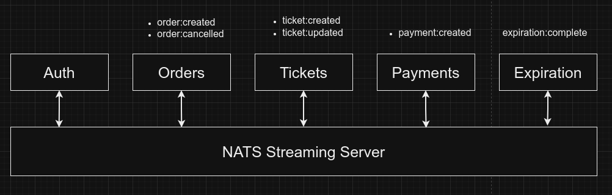
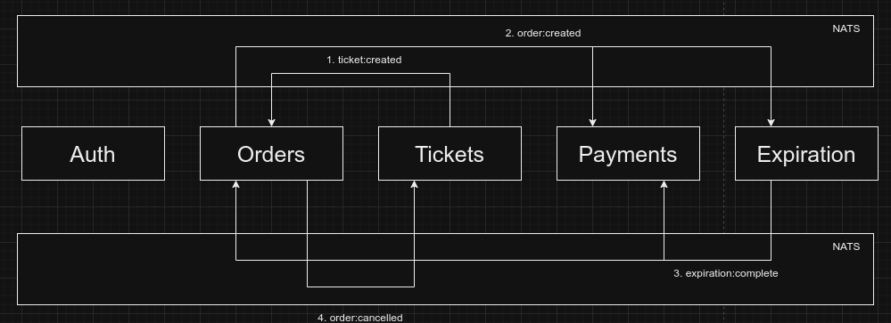

# Ticketing Platform

## Overview

Welcome to our Ticketing Platform GitHub repository! This project is a ticketing platform designed for buying and selling tickets, structured with a microservices architecture. Below, you'll find essential information about the project, its microservices, and the technologies used.

## Microservices

1. **Auth Service:**
   - Responsible for handling authentication logic.

2. **Orders Service:**
   - Handles the order management functionality.

3. **Payments Service:**
   - Manages payment processing, utilizing Stripe for actual payments.

4. **Expiration Service:**
   - Manages order expiration, providing a 60-second window for confirmation and payment.

5. **Tickets Service:**
   - Handles details related to tickets.

6. **Infra Service:**
   - Contains deployment-related code.

### Event Emited by each service

### Example flow for expiry


## Libraries

We have created a library called `@gittrix/common` to reduce code duplication among the microservices.

## Databases

Each microservice has its separate MongoDB database, except for the Expiration Service, which uses Redis.

## Development and Deployment

- **Local Development:**
  - We use Skaffold for ease of local development.

- **Deployment:**
  - Kubernetes is utilized for deployment.
  - Docker Hub stores all the latest images for the services.

## Technologies Used

- **Backend:**
  - Express.js with TypeScript.

- **UI:**
  - Next.js.

- **Message Communication:**
  - NATS Streaming Service.

## Setup

Before running the project locally, ensure you have the following prerequisites installed:

- [Docker](https://www.docker.com/get-started)
- [Skaffold](https://skaffold.dev/docs/install/)

### Local Development

1. Clone the repository:
   ```bash
   git clone https://github.com/your-username/ticketing-platform.git
2. Navigate to the project directory:
    ```bash
   cd ticketing-platform
   ```
3. Run Skaffold in development mode:
    ```bash
   skaffold dev
   ```

